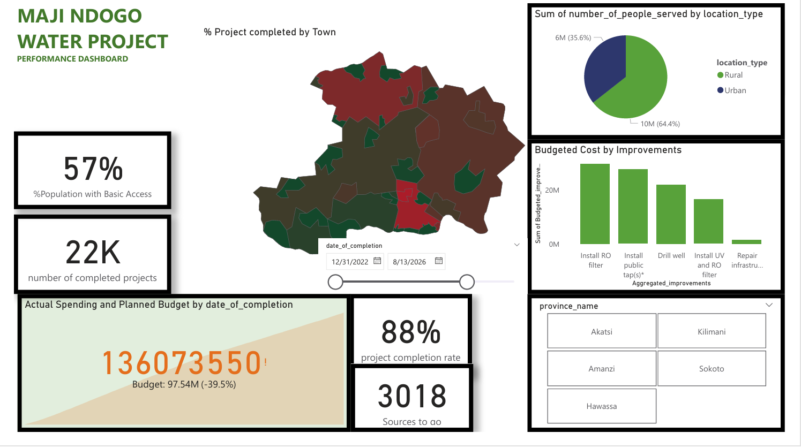

# Data Analytics & Visualization Portfolio

Welcome to my portfolio showcasing data analysis and visualization projects.

## Maji Ndogo Water Project - Performance Dashboard

**Project Overview & Results**

As of December 2027, the Maji Ndogo Water Project successfully completed **25,000 projects**, providing basic water access to **66% of the target population**. The project exceeded its allocated budget, with public tap installations accounting for the largest share (**28.83%**). Sokoto province stood out with the highest investment in drill wells.

<strong>View Detailed Insights →</strong>

The project demonstrated effective execution in enhancing water accessibility across multiple provinces. Key achievements include surpassing the planned budget while delivering significant impact on population coverage. Public taps represented the highest budget allocation, while Sokoto province had the highest expenditure on drill wells.

---

**Tools Used**: Power BI, Excel, SQL

**My Contribution**: Data cleaning, dashboard design, KPI development and insight generation
